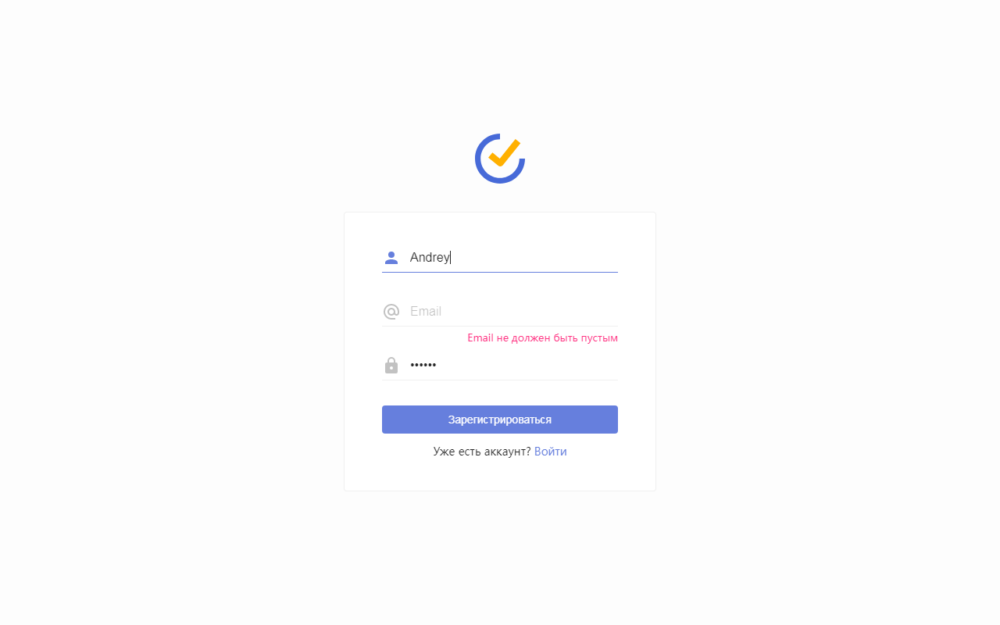

## Demo
https://todo-project-fbfb7.web.app

## Screenshots




## Core stack
- Vue 2 (options API)
- Vuex
- Tailwind CSS
- Vue Router
- Vue CLI
- HTML
- Firebase
- Webpack
- ESLint (style guide Airbnb)
- Babel

## Project setup
```
npm install
```

### Compiles and hot-reloads for development
```
npm run serve
```

### Compiles and minifies for production
```
npm run build
```

### Lints and fixes files
```
npm run lint
```

### Customize configuration
See [Configuration Reference](https://cli.vuejs.org/config/).
